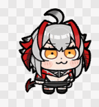
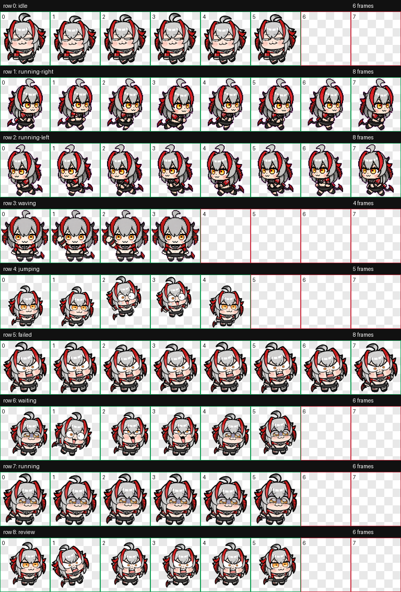

# Vishdale Codex Pet

A custom Codex floating pet package for **维什戴尔**: a compact chibi demon mascot with gray hair, red-and-black horns, orange-yellow eyes, and a small demon tail.

[中文说明](README.md)

## Preview

<p>
  
  
  
  
  
</p>



## Install

Copy the `vishdale` folder into:

```text
%USERPROFILE%\.codex\pets\vishdale
```

Then restart Codex. If it does not switch automatically, open Settings -> Appearance -> Pets, refresh custom pets, and select **维什戴尔**.

The custom avatar id is:

```text
custom:vishdale
```

## Package Contents

- `vishdale/pet.json` - Codex pet manifest.
- `vishdale/spritesheet.webp` - 1536x1872 animated pet atlas.
- `media/*.gif` - lightweight README preview animations.
- `media/contact-sheet.png` - visual overview of all animation states.
- `qa/contact-sheet.png` - QA contact sheet.
- `qa/validation.json` - atlas validation output.
- `qa/review.json` - frame extraction and review output.
- `source-assets-summary.json` - mapping from supplied source GIFs to pet states.

## Source State Mapping

- `idle`: `2.gif`
- `waiting`: `1.gif`
- `jumping`: `4.gif`
- `failed`: `6.gif`
- `review`: `3.gif`
- `running`: `5.gif`
- `running-right`, `running-left`, and `waving` are retained from the earlier generated pet atlas because they fit Codex directional and waving states better than the supplied expression GIFs.

## Notes

The atlas was validated for Codex's 8x9 pet layout: 8 columns, 9 animation rows, 192x208 pixels per cell. Unused cells remain transparent.
